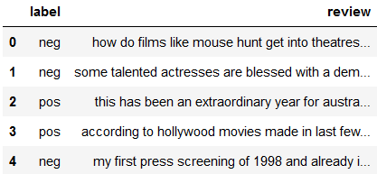

# movie-reviews-clf
This project is part of the [NLP course](https://www.udemy.com/course/nlp-natural-language-processing-with-python/) on udemy.\
The <b>task</b> in this project is to classify movie reviews into negative or positive.

## Dataset
\
This dataset has 2,000 reviews and has ratio 1:1 for negative and positive review.

### Cleansing
We clean this data before use. We removed NaN rows and reviews that contained empty spaces.\
This process leaves 1,938 reviews.

## Approach
### Model
<ul>
  <li>Naive-bayes</li>
  <li>Linear SVC</li>
</ul>

### Text extraction
In this approach we used <b>TFIDF Vectorizer</b> for text extraction.

### Stop words
We also removed stop words from the text and we calculated the difference in the duration of training and model testing before and after removing the stopword.
```
stopwords = ['a', 'about', 'an', 'and', 'are', 'as', 'at', 'be', 'been', 'but', 'by', 'can', \
             'even', 'ever', 'for', 'from', 'get', 'had', 'has', 'have', 'he', 'her', 'hers', 'his', \
             'how', 'i', 'if', 'in', 'into', 'is', 'it', 'its', 'just', 'me', 'my', 'of', 'on', 'or', \
             'see', 'seen', 'she', 'so', 'than', 'that', 'the', 'their', 'there', 'they', 'this', \
             'to', 'was', 'we', 'were', 'what', 'when', 'which', 'who', 'will', 'with', 'you']
```


## Result
Removing stopwords can reduce training time, but it can also reduce model accuracy. Since there were only less than 2000 samples in this project, the time reduction was not significant.

